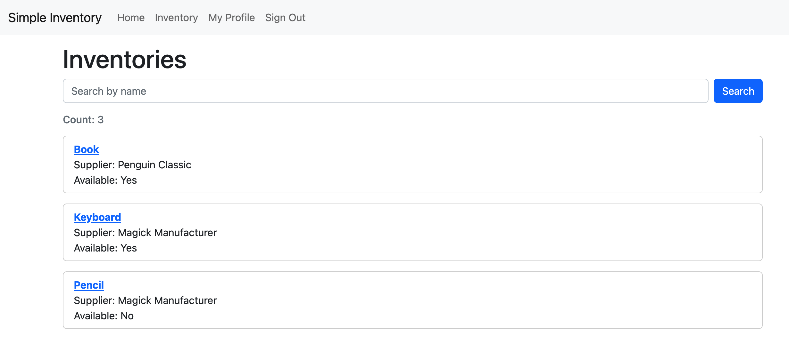
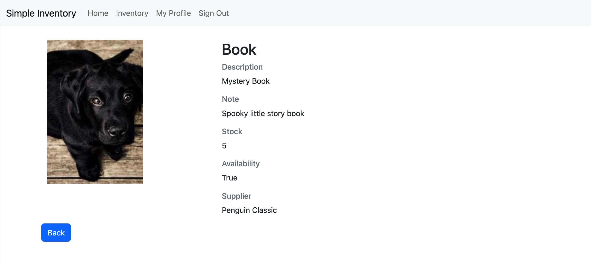
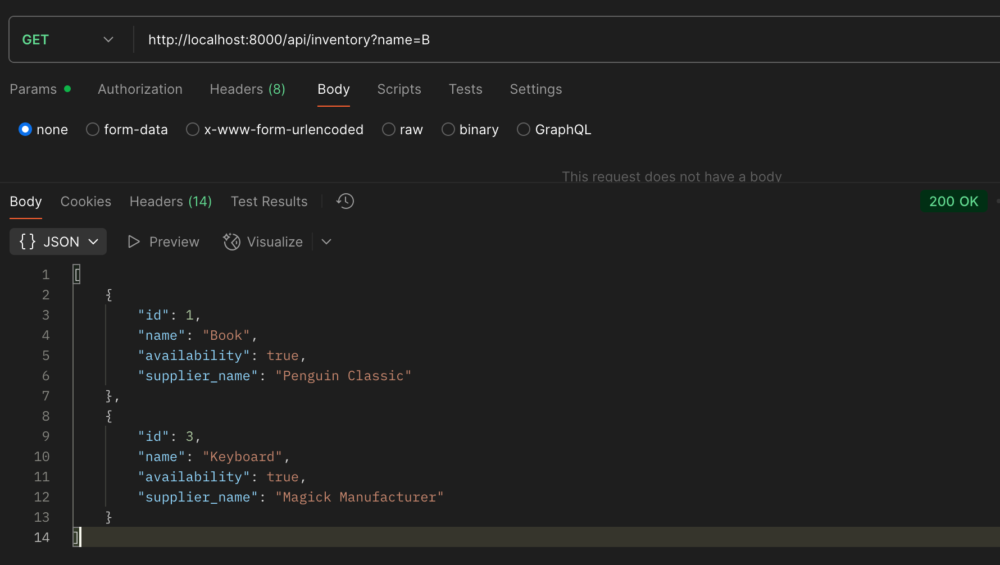

# Simple Inventory

Simple Inventory Management System

[](https://github.com/cookiecutter/cookiecutter-django/)
[](https://github.com/astral-sh/ruff)

This project is scaffolded by cookiecutter-django due to it provides full linting, typechecking and containerization.

For the code that you may concern, please look at:

- simple_inventory/inventory/\*

## Settings

### Run locally

This will require docker and docker-compose.

Using Make

```bash
make build
make up
```

or using docker-compose

```bash
docker compose -f docker-compose.local.yml up -d
```

#### Running tests with pytest

    $ pytest simple_inventory/inventory

### Using the app

After you setup the docker container, you should be able to access the server on:

1. http://locahost:8000/admin - Admin page
2. http://locahost:8000/inventory - Inventory list
3. http://locahost:8000/inventory/:pk - Inventory detail
4. http://locahost:8000/api/inventory - Inventory List API

You can create a superuser in the container and login into the above page. Note those page are being protected with session-based auth.

#### Screenshot

Inventory List

Inventory Detail

Inventory List API


## Deployment

The following details how to deploy this application.

### Docker

See detailed [cookiecutter-django Docker documentation](https://cookiecutter-django.readthedocs.io/en/latest/3-deployment/deployment-with-docker.html).
